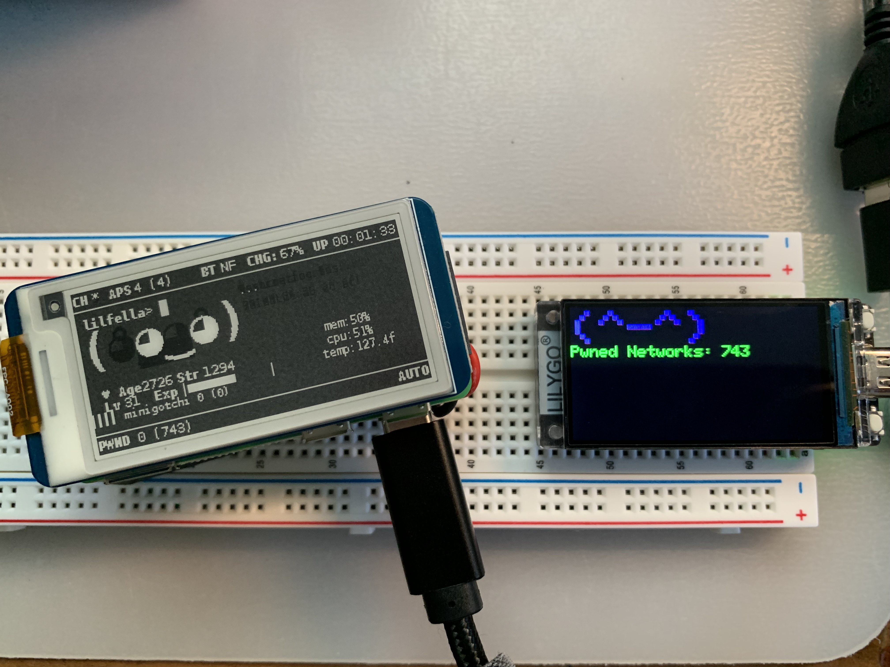

# minigotchi-ESP32 - ミニゴッチ

</img>
</img>

</img>
</img>

## The [Minigotchi](https://github.com/Pwnagotchi-Unofficial/minigotchi) ported to the ESP32

</img>

### Intro

Due to a surge in people asking for ESP32 support, I have created this fork. Fundamentally the ESP8266 and ESP32 can perform similar functions, although the ESP32 has more features, memory, computing power, etc. We have more and more ESP32s being supported, feel free to ask me about supporting a device.

We just made a [discord server](https://discord.gg/EhTAr7PwVP)! Feel free to join!

### Install guide

See the [install guide](INSTALL.md).

### Languages

The code is written in these languages.

- _C_
- _C++_

Note that the _C++_ in Arduino is slightly modified from what I have heard. See [this Reddit question](https://www.reddit.com/r/arduino/comments/x46sml/is_arduino_programming_language_c/) for more about this. Arduino probably has tweaked it to be more beginner-friendly, although still being [low-level](https://en.wikipedia.org/wiki/Low-level_programming_language). The _Pwnagotchi_ is a complex machine written in _Python_ and _Go_, so code from the Pwnagotchi Project is **not** compatible with mine.

### Prerequisites

- Arduino IDE
- A good understanding of coding/programming if you plan on contributing
- Any ESP32-S\* or ESP32\* based microcontroller (must have two cores)
- A reliable and appropriate power source and supply for the hardware
- Patience (a lot of it)
- The ability to read

### How it operates/works

See the [wiki](https://github.com/Pwnagotchi-Unofficial/minigotchi/wiki/How-the-Minigotchi-works).

### Hardware

See the [wiki](https://github.com/Pwnagotchi-Unofficial/minigotchi/wiki/Hardware).

### To do

See this [project](https://github.com/orgs/Pwnagotchi-Unofficial/projects/4).

### Contributing

See the Contributing Guidelines [here](CONTRIBUTING.md).

### FAQ

See the [wiki](https://github.com/Pwnagotchi-Unofficial/minigotchi/wiki/FAQ).

### Communication

See the [wiki](https://github.com/Pwnagotchi-Unofficial/minigotchi/wiki/Communication#communication).

### Last but not least... Some thank you's

**If you believe your project wasn't properly credited, please let me know ASAP! Here's how you can [communicate](https://github.com/Pwnagotchi-Unofficial/minigotchi/wiki/Communication#communication) with me.**

**Thanks to these projects for making this a little bit more possible for me, I have used libraries/code from these projects and implemented it here:**

- [Pwngrid](https://github.com/evilsocket/pwngrid), this is what the project is trying to replicate, specifically the Pwnagotchi's system of peer detection. If this didn't exist, this project probably wouldn't have either.

- [ESP32 Marauder](https://github.com/justcallmekoko/ESP32Marauder), similar to the ESP8266 Deauther, although packed with more features and support for Flipper Zero's ESP32 WiFi Card Module. It has wardriving capabilities, BLE, Pwnagotchi Scanning, and Deauthing available. This is a very cool project, I highly recommend checking this out if you have an ESP32.

- [Milkydeveloper](https://github.com/MilkyDeveloper), idk what he did but he wanted to be here ig so...(this is totally not an advertisement)

- [esp-idf](https://github.com/espressif/esp-idf), the Espressif development framework for IOT devices like the ESP32

- [arduino-ESP32](https://github.com/espressif/arduino-esp32), the core Arduino libraries for the ESP32 compatibility in the Arduino IDE

- I'd also like to thank [PiSugar](https://www.pisugar.com/) for the partnership with Pwnagotchi-Unofficial! Your batteries are amazing and have contributed heavily in the creation of this project.

**Made with ❤️ by [@dj1ch](https://github.com/dj1ch) and the rest of the Pwnagotchi-Unofficial team!**
