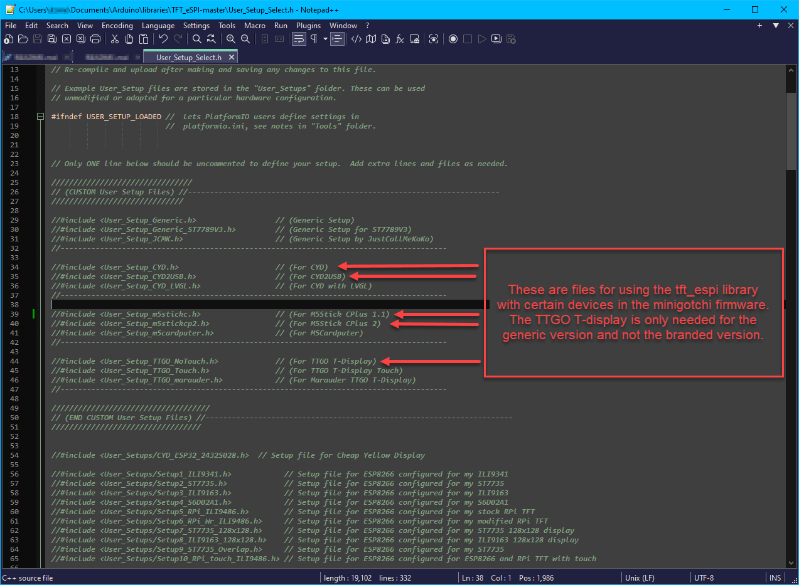
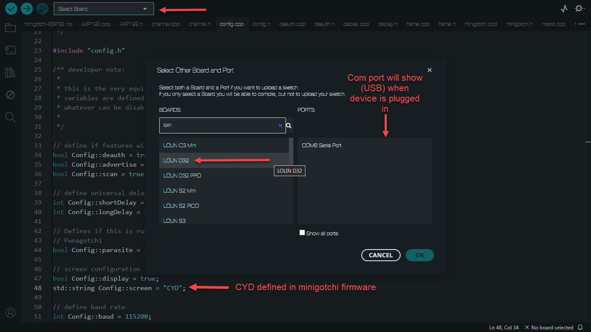
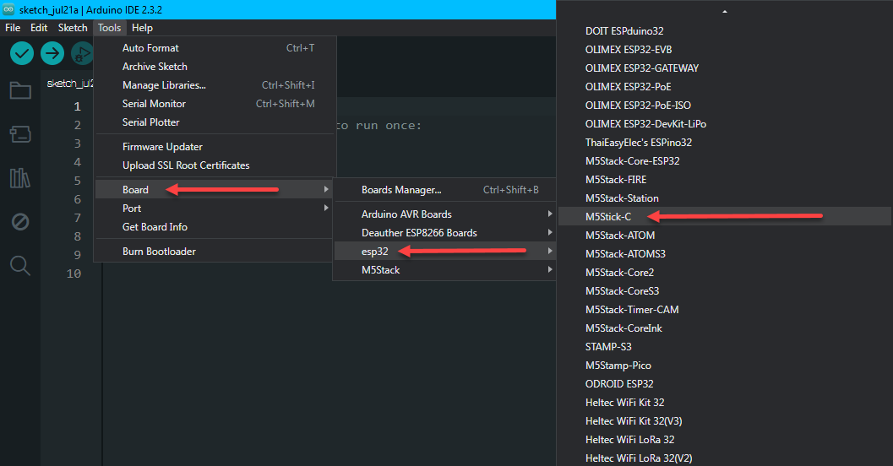
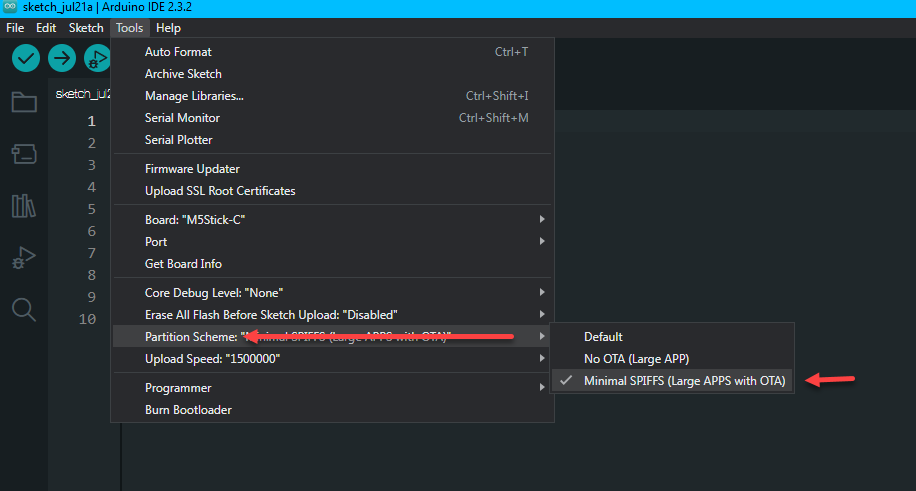

## Custom User_Setup Files for Specific Firmwares and Devices

Custom User_Setup files are essential for ensuring proper functionality of certain devices. These files contain crucial information such as GPIO pins, display configurations, and other necessary settings.

Utilizing these files is straightforward, as each is designed with clear and intuitive naming conventions to simplify device configuration.

---

# Configuring User_Setup Files

--Before proceeding, ensure you create a complete backup of the TFT_eSPI folder--

These files need to be integrated into your TFT_eSPI library. The images below illustrate the precise location within the library folder where these files should be placed. Once relocated, locate and open the User_Setup_Select.h file.

Inside this file, identify the specific display you are using (refer to the User_Setup file Screenshot for guidance). To activate your preferred display device, uncomment the corresponding entry by removing the "//" preceding it. It is crucial to have only one display configuration uncommented at any given time and to verify the accuracy of the display name to avoid errors.

## User_Setup file Screenshot

---

Board selction in Arduino IDE for the M5 devices, the CYD and the non branded TTGO T-display are shown below. The partition scheme for the CYD is the same as the
M5 devices which is Minimal SPIFFS (Large APPS with OTA).

## CYD board selection Screenshot

---

## M5 board selection Screenshots

 

---

<b>Below you'll find instructions for certain projects using certain devices</b>

Minigotchi Configurations

If you intend to flash the minigotchi firmware to an M5 device or a generic ttgo t-display, ensure you select one of the following User_Setup files that corresponds with the device available in the firmware:
 
- (User_Setup_CYD.h) For use with a ESP32-2432S028R also called a CYD
 
- (User_Setup_CYD2USB.h) For use with a CYD that has microUSB & USB-C. Only define in User_Setup_Select.h & not in minigotchi firmware
 
- (User_Setup_m5stickc.h) For use with a M5Stick C Plus 1.1
 
- (User_Setup_m5stickcp2.h) For use with a M5Stick C Plus 2
 
- (User_Setup_m5cardputer.h) For use with a M5Cardputer
 
- (User_Setup_TTGO_NoTouch.h) Can be used with a generic (Non branded) TTGO T-Display

